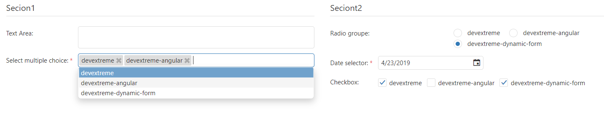

# devextrem-dynamic-form

devextrem-dynamic-form is library build for angular applications that helps to build and generate forms using un simple class and some decorators 



## Installation

The package can be installed via NPM : 
`npm install --save devextreme-dynamic-form`

#### Devextrem project
If you are already using **devextreme** in your angular project, you don't need to add anything, just install it and enjoy it

#### Devextreme don't configured yet
if you are not using devextreme in your angular project, you have to add those two dependencies : 
`npm install --save devextreme devextreme-angular`

then, in your `angular.json (angular-cli.json)`, add the `dx.common.css`and the `theme` you want to use, for example : 
```javascript
{ 
  ... 
  "apps": [ 
    { 
      ... 
      "styles": [ 
        ...
        "../node_modules/devextreme/dist/css/dx.common.css", 
        "../node_modules/devextreme/dist/css/dx.light.css", 
        "styles.css" 
      ], 
      ... 
      } 
    } 
  ], 
... 
} 
```
You will need to also to add this in your **tsconfig.json**
```javascript
"compilerOptions": {
    ...
    "paths": {
        "jszip": [
            "node_modules/jszip/dist/jszip.min.js"
        ]
    }
}
```

## Configuration

**.** In order to use this component, you need first to import `DxDynamicFormrmModule` in your app.module, or the module that will be holding this component :
```javascript
@NgModule({ 
  ...
  imports: [ 
  ...
    DxDynamicFormrmModule 
  ], 
  ...
}) 
export class AppModule { } 
```

**.** Create a class, for example `Test` and decorate all your attributes with annotations (decorators):

```javascript
import {FormDeco,FormTypes,SectionForm} from "devextreme-dynamic-form";

export class Test {

    @SectionForm("Secion1")
    section;

    @FormDeco({
        label : "text Area",
        type : FormTypes.TEXTAREA,
        defaultValue : ""
    })
    firstField;

    @FormDeco({
        label : "select multiple choice",
        type : FormTypes.SELECT,
        datas : [{value : 0, text : "devextreme"},{value : 1, text : "devextreme-angular"},{value : 2, text : "devextreme-dynamic-form"}],
        required : true,
        multiple : true,
        defaultValue : [0,1]
    })
    secondField;

    @FormDeco({
        label : "select an email",
        type : FormTypes.INPUT,
        required : true,
        isEmail : true,
        isEmailErrorString : "please enter a valid email!",
        lengthString : true,
        max :10,
        lengthErrorString : "email too long !!"
    })
    theirdFild;

    @SectionForm("Seciont2")
    section1;

    @FormDeco({
        label : "Radio groupe",
        type : FormTypes.RADIO,
        datas : [{value : 0, text : "devextreme"},{value : 1, text : "devextreme-angular"},{value : 2, text : "devextreme-dynamic-form"}],
        defaultValue : 2
    })
    fourthField;

    @FormDeco({
        label : "Date selector",
        type : FormTypes.DATE,
        defaultValue: new Date(),
        required : true
    })
    fifthField;

    @FormDeco({
        label : "Number selector",
        type : FormTypes.CHEKBOX,
        min : 3, // if not given, no min is considered
        step : 0.1 //default 1
    })
    sixthField;
}

```
And create a **ts** file where you export all classes from witch you want to generate a form, lets call it **handler.ts**, in our case, it will contain only this line:
```javascript
export {Test} from "./test";
```

**handler.ts** will be used to instantiate the forms'classes.

**.** In your app.component.ts, import `DxDynamicFormComponent` and `handler.ts content` :
```javascript
import * as handler from "./handler";
import { DxDynamicFormComponent } from 'devextreme-dynamic-form';
...
@Component({
  selector: 'app-root',
  templateUrl: './app.component.html',
  styleUrls: ['./app.component.css']
})
export class AppComponent {
  @ViewChild(DxDynamicFormComponent) dxDynamicForm : DxDynamicFormComponent;

  handlerInst = handler;
  ...

}

```
`handlerInst`will be passed as an `@Input()` param to **dx-dynamic-form**

**.** In your app.component.html, just add the selector tag of the library with some input parameters :
```javascript
<dx-dynamic-form 
    [handlerInstantition]="handlerInst" 
    colNumber="2" 
    width="1200" 
    nameCls="Test">
</dx-dynamic-form >

```
**.** Finally, if you wana retreive selected or introduced datas of the form, you have to call **generateDataToSend** method line this : 
```javascript
this.dxDynamicForm..generateDataToSend();
```
this method will first check if the form is `valid`, if it's not, it return an empty array, and `display alerts` in fields in which there a validation error.


## Credits

this project is based on [devextreme](https://github.com/DevExpress/DevExtreme) modules, an incredible cross-platform component containing everything you need to create responsive web apps. 

## Licence
[DevExtreme licensing](https://js.devexpress.com/licensing/)

[EULA](https://js.devexpress.com/EULAs/DevExtremeNonCommercial/) licence